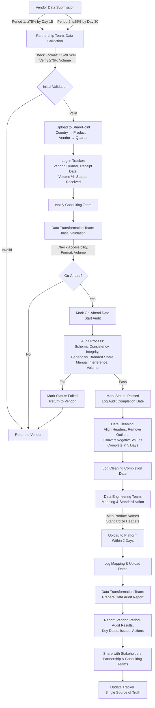

```mermaid
graph TD
    A[Vendor Data Submission] -->|Period 1: ≥75% by Day 15| B[Partnership Team: Data Collection]
    A -->|Period 2: ≤25% by Day 30| B
    B -->|Check Format: CSV/Excel<br>Verify ≥75% Volume| C{Initial Validation}
    C -->|Valid| D[Upload to SharePoint<br>Country → Product → Vendor → Quarter]
    C -->|Invalid| E[Return to Vendor]
    D --> F[Log in Tracker:<br>Vendor, Quarter, Receipt Date,<br>Volume %, Status: Received]
    F --> G[Notify Consulting Team]
    G --> H[Data Transformation Team: Initial Validation]
    H -->|Check Accessibility, Format, Volume| I{Go-Ahead?}
    I -->|Yes| J[Mark Go-Ahead Date<br>Start Audit]
    I -->|No| E
    J --> K[Audit Process:<br>Schema, Consistency, Integrity,<br>Generic vs. Branded Share,<br>Manual Interference, Volume]
    K -->|Pass| L[Mark Status: Passed<br>Log Audit Completion Date]
    K -->|Fail| M[Mark Status: Failed<br>Return to Vendor]
    M --> E
    L --> N[Data Cleaning:<br>Align Headers, Remove Outliers,<br>Convert Negative Values<br>Complete in 5 Days]
    N --> O[Log Cleaning Completion Date]
    O --> P[Data Engineering Team:<br>Mapping & Standardization]
    P -->|Map Product Names<br>Standardize Headers| Q[Upload to Platform<br>Within 2 Days]
    Q --> R[Log Mapping & Upload Dates]
    R --> S[Data Transformation Team:<br>Prepare Data Audit Report]
    S --> T[Report: Vendor, Period, Audit Results,<br>Key Dates, Issues, Actions]
    T --> U[Share with Stakeholders:<br>Partnership & Consulting Teams]
    U --> V[Update Tracker:<br>Single Source of Truth]
```