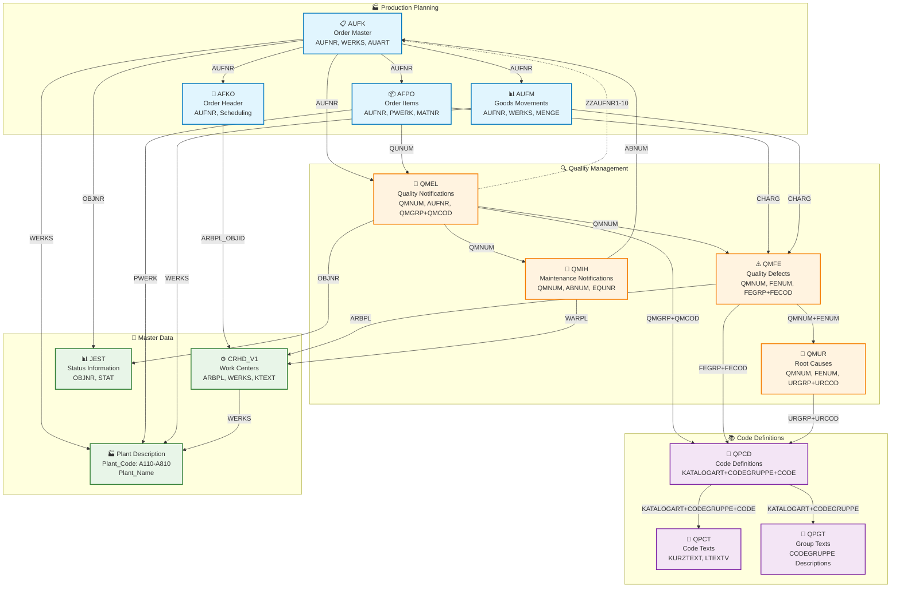

```mermaid
    graph TB
    %% Production Planning Tables
    subgraph PP ["🏭 Production Planning"]
        AUFK["📋 AUFK<br/>Order Master<br/>AUFNR, WERKS, AUART"]
        AFKO["📅 AFKO<br/>Order Header<br/>AUFNR, Scheduling"]
        AFPO["📦 AFPO<br/>Order Items<br/>AUFNR, PWERK, MATNR"]
        AUFM["📊 AUFM<br/>Goods Movements<br/>AUFNR, WERKS, MENGE"]
    end

    %% Quality Management Tables
    subgraph QM ["🔍 Quality Management"]
        QMEL["🚨 QMEL<br/>Quality Notifications<br/>QMNUM, AUFNR, QMGRP+QMCOD"]
        QMFE["⚠️ QMFE<br/>Quality Defects<br/>QMNUM, FENUM, FEGRP+FECOD"]
        QMUR["🎯 QMUR<br/>Root Causes<br/>QMNUM, FENUM, URGRP+URCOD"]
        QMIH["🔧 QMIH<br/>Maintenance Notifications<br/>QMNUM, ABNUM, EQUNR"]
    end

    %% Code Definition Tables
    subgraph CODES ["📚 Code Definitions"]
        QPCD["📖 QPCD<br/>Code Definitions<br/>KATALOGART+CODEGRUPPE+CODE"]
        QPCT["📝 QPCT<br/>Code Texts<br/>KURZTEXT, LTEXTV"]
        QPGT["📂 QPGT<br/>Group Texts<br/>CODEGRUPPE Descriptions"]
    end

    %% Master Data Tables
    subgraph MD ["🏢 Master Data"]
        PLANT["🏭 Plant Description<br/>Plant_Code: A110-A810<br/>Plant_Name"]
        CRHD["⚙️ CRHD_V1<br/>Work Centers<br/>ARBPL, WERKS, KTEXT"]
        JEST["📊 JEST<br/>Status Information<br/>OBJNR, STAT"]
    end

    %% Main Integration Flow - Production Orders
    AUFK -->|AUFNR| AFKO
    AUFK -->|AUFNR| AFPO
    AUFK -->|AUFNR| AUFM

    %% Plant Linkages (Multiple Sources)
    AUFK -->|WERKS| PLANT
    AFPO -->|PWERK| PLANT
    AUFM -->|WERKS| PLANT
    CRHD -->|WERKS| PLANT

    %% Quality Integration Chain
    AUFK -->|AUFNR| QMEL
    QMEL -->|QMNUM| QMFE
    QMFE -->|QMNUM+FENUM| QMUR
    QMEL -->|QMNUM| QMIH

    %% Code Description Chain
    QMEL -->|QMGRP+QMCOD| QPCD
    QMFE -->|FEGRP+FECOD| QPCD
    QMUR -->|URGRP+URCOD| QPCD
    QPCD -->|KATALOGART+CODEGRUPPE+CODE| QPCT
    QPCD -->|KATALOGART+CODEGRUPPE| QPGT

    %% Work Center Integration
    AFKO -->|ARBPL_OBJID| CRHD
    QMFE -->|ARBPL| CRHD
    QMIH -->|WARPL| CRHD

    %% Status Integration
    AUFK -->|OBJNR| JEST
    QMEL -->|OBJNR| JEST

    %% Additional Quality Links
    AFPO -->|QUNUM| QMEL
    AFPO -->|CHARG| QMFE
    AUFM -->|CHARG| QMFE

    %% Custom Order Fields
    QMEL -.->|ZZAUFNR1-10| AUFK
    QMIH -->|ABNUM| AUFK

    %% Styling
    classDef production fill:#e1f5fe,stroke:#0277bd,stroke-width:2px
    classDef quality fill:#fff3e0,stroke:#f57c00,stroke-width:2px
    classDef codes fill:#f3e5f5,stroke:#7b1fa2,stroke-width:2px
    classDef master fill:#e8f5e8,stroke:#2e7d32,stroke-width:2px

    class AUFK,AFKO,AFPO,AUFM production
    class QMEL,QMFE,QMUR,QMIH quality
    class QPCD,QPCT,QPGT codes
    class PLANT,CRHD,JEST master

```